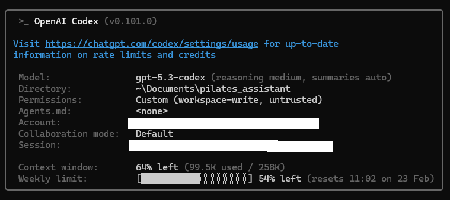
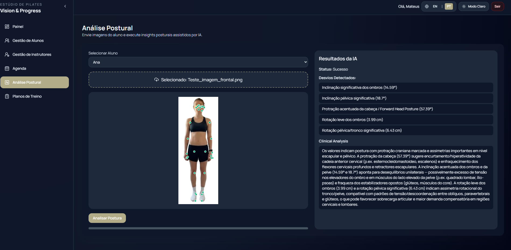
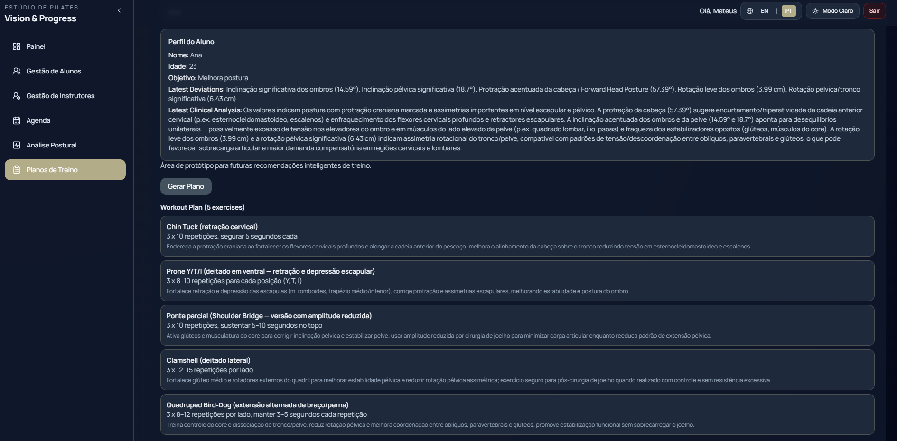

# 🧘 Pilates Vision & Progress
Bem-vindo à documentação oficial do Vision & Progress, uma solução tecnológica para a gestão de estúdios de Pilates. O sistema foca na automatização administrativa e, principalmente, no uso de ferramentas de Inteligência Artificial para realizar análises posturais precisas e gerar treinos personalizados com base na evolução e nos objetivos específicos de cada aluno.

## Deploy Online (Hugging Face)
[](https://huggingface.co/spaces/MateusZanco/pilates-vision-progress)

## 1. Descricao do problema e da solucao proposta
A gestão de estúdios de Pilates enfrenta três grandes gargalos que comprometem a eficiência e a qualidade do atendimento:

1. **Fragmentação Administrativa e Carga Burocrática:** O fluxo de trabalho atual é ineficiente. Frequentemente, os instrutores planejam os exercícios "no momento" da aula e, posteriormente, precisam de gastar tempo adicional para registar manualmente no sistema o que foi realizado. Este "trabalho duplo" aumenta a carga administrativa e a probabilidade de esquecimentos ou erros nos registos.

2. **Subjetividade Técnica na Avaliação:** A avaliação postural manual depende exclusivamente da perceção visual do instrutor. Esta subjetividade pode levar a diagnósticos inconsistentes entre diferentes profissionais ou até mesmo falhas na identificação de desvios sutis, dificultando um acompanhamento clínico rigoroso.

3. **Dificuldade de Personalização em Escala:** Criar planos de treino que considerem simultaneamente o histórico clínico (como hérnias, escolioses e cirurgias), a evolução semanal e os objetivos do aluno é um processo manual extremamente demorado. Sem o apoio da tecnologia, torna-se quase impossível oferecer uma personalização profunda para todos os alunos do estúdio de forma ágil.

### Solução proposta
O **Pilates Vision & Progress** resolve esses desafios integrando Visão Computacional (MediaPipe) com IA Generativa (OpenAI). O sistema extrai métricas biomecânicas tridimensionais a partir de fotos 2D e utiliza uma arquitetura Multi-Agente para:
1. Emitir um laudo clínico determinístico baseado em ângulos articulares.
2. Prescrever um plano de treino personalizado fundamentado na literatura oficial do Pilates via Web Scraping.

## 2. Arquitetura de LLM e Frameworks
O sistema utiliza uma arquitetura Multi-Agente orquestrada via FastAPI, separando o processamento sensorial do raciocínio clínico. A comunicação com o LLM é realizada através do **SDK Oficial da OpenAI para Python**, em vez de requisições diretas (HTTP puro) ou frameworks de abstração como LangChain.

**O Fluxo de Dados (Pipeline):**
* **Input do Usuário**: O instrutor realiza o upload de uma foto 2D do aluno (frontal ou perfil) através da interface.
* **Pré-processamento (Visão Computacional)**: Antes de acionar o LLM, o MediaPipe extrai as coordenadas 3D das articulações e um script de Álgebra Linear atua como *View Detector*. Este filtro remove chaves de métricas irrelevantes (como dados sagitais em fotos frontais) para limpar o ruído antes do processamento pela IA.
* **Prompt**:
    * **Agente 1 (Análise)**: O prompt utiliza a estratégia de *Grounding*, contendo *Reference Ranges* (valores biomecânicos normais) para forçar o raciocínio matemático e evitar diagnósticos subjetivos.
    * **Agente 2 (Treino)**: Utiliza *Role-Prompting* de instrutor sênior de Pilates e instruções específicas para orquestração de ferramentas.
* **Modelo**: Utilizamos o **`gpt-5-mini`**. Por ser um modelo de nova geração, ele gerencia o raciocínio lógico e o determinismo internamente; o parâmetro de temperatura não está disponível nesse modelo.
* **Tools (Ferramentas)**: O LLM (Agente 2) entra em um *loop* autônomo e invoca a ferramenta `fetch_pilates_exercises()`. Esta ferramenta é um Web Scraper em Python (`BeautifulSoup`) que lê ativamente a literatura de sites oficiais (Blog Pilates) em tempo real para fundamentar a prescrição.
* **Resposta**: O modelo conclui a orquestração e retorna um *Structured Output* estrito em JSON. O backend processa esse objeto e o envia para o Frontend React renderizar o Laudo Clínico detalhado e a Prescrição de Treino personalizada.

## 3. Escolhas de design
### Arquitetura
- **Frontend:** React + Vite + Tailwind CSS.
- **Backend:** FastAPI + SQLite.
- **Inteligência Artificial:** MediaPipe (Visão) + OpenAI SDK (LLM).
- **Infra:** Docker Compose + modo single-container.

### Justificativas
- **FastAPI:** produtividade alta para APIs, validação, manutenção e documentação.
- **OpenAI SDK (GPT-5-mini):** Escolha estratégica para garantir Structured Outputs (JSON) consistentes e execução estável de Tool Calling sem a complexidade de frameworks de terceiros.
- **MediaPipe:** Utilizado para extração de coordenadas 3D no espaço real (World Landmarks), permitindo cálculos biomecânicos precisos que superam a estimativa visual 2D comum.
- **SQLite:** complexidade baixa para protótipo funcional.
- **React/Vite:** iteração rápida e fluida de interface.
- **Tailwind:** consistência visual e velocidade de composição de UI.

### Escolhas de UX/UI
- Localização (i18n): Suporte nativo a Português e Inglês, permitindo que o LLM adapte o tom e o idioma do laudo e da prescrição dinamicamente.

- Visualização Científica: Renderização de pontos-chave (Landmarks) sobre a imagem original para fornecer feedback visual imediato ao instrutor.

- Estados de Carregamento: Como o processo envolve Visão Computacional e consultas web (Web Scraping) via LLM, foram implementados estados de loading granulares para cada etapa.

### Arquitetura da aplicação
```bash
pilates_assistant/
├── app/
│   ├── backend/                        # API FastAPI + SQLite
│   │   ├── main.py                     # Endpoints (students, instructors, appointments, analyze, generate_plan)
│   │   ├── models.py                   # Modelos ORM (Student, Instructor, Assessment, Appointment)
│   │   ├── schemas.py                  # Schemas Pydantic (requests/responses)
│   │   ├── database.py                 # Engine SQLAlchemy e sessão DB
│   │   ├── requirements.txt            # Dependências Python do backend
│   │   └── Dockerfile                  # Imagem Docker do backend
│   └── frontend/                       # Aplicação React (Vite + Tailwind)
│       ├── src/
│       │   ├── App.jsx                 # Shell principal da aplicação
│       │   ├── api.js                  # Cliente Axios para o backend
│       │   ├── i18n.jsx                # Internacionalização PT/EN
│       │   ├── components/             # Componentes reutilizáveis
│       │   └── pages/                  # Páginas de domínio (Dashboard, Analysis, Plans, Schedule, etc.)
│       ├── package.json
│       ├── vite.config.js
│       ├── tailwind.config.js
│       └── Dockerfile
├── agents/
│   ├── pipeline.py                     # Orquestração da análise postural (MediaPipe + LLM)
│   └── workout_agent.py                # Orquestração multi-agent para geração de treino (tool calling)
├── tools/
│   ├── posture_tools.py                # Extração de landmarks e métricas posturais
│   └── web_tools.py                    # Scraper de exercícios (requests + BeautifulSoup)
├── prompts/
│   ├── system_prompt.txt
│   └── postural_analysis_message.txt   # Prompt da análise clínica
├── data/
│   └── pilates_vision_progress.db      # Base SQLite local (quando aplicável)
├── docker-compose.yml                  # Orquestração frontend + backend
├── Dockerfile                          # Build single-container (quando aplicável)
├── README.md
└── WIKI.md
```

## 4. O que funcionou bem
Utilização do modelo GPT-5.3-Codex como ferramenta de apoio no desenvolvimento da aplicação.



Pontos com melhor desempenho:
- A partir de uma definição clara de requisitos, a estrutura base do projeto (diretórios, ambientes virtuais e dependências) foi gerada em apenas alguns minutos. O prompt de sistema utilizado para essa etapa foi:

>*Building a prototype called Pilates Vision & Progress, a professional management and postural analysis tool for Pilates studios.
Project structure: Create two main directories: /backend and /frontend.
Backend (FastAPI + SQLite).
Frontend (React + Vite + Tailwind CSS)
Ensure the code is modular and clean.
Provide a requirements.txt for Python and a package.json for React.
Add loading states for all button interactions.
Creates a Python virtual environment (.venv) inside the /backend folder.
Activates the virtual environment.
Installs all dependencies from requirements.txt.
Also, generate a comprehensive .gitignore file that excludes the virtual environment folder, __pycache__, node_modules, and the SQLite .db file to keep the repository clean.*

- Entregas incrementais de funcionalidades com baixo atrito, através de implementação e testes de pequenas elaborações 
>*Implement CPF masking and validation in the Student registration form
Apply a mask to the CPF field so it automatically formats as xxx.xxx.xxx-xx
Limit the input to 11 digits (only numbers).
Inputs phone also only numbers*

- Implementacao de requisitos transversais (tema dark/light, i18n, validacoes, estados de loading).
>*Implement multi-language support (English and Portuguese) for the entire application. Store the user's language preference in localStorage so it persists after refresh. Translate all UI elements: Sidebar menus, Dashboard stats, Form labels (Student/Instructor), Table headers, and the Postural Analysis interface
Add a language toggle in the Sidebar (next to the Dark Mode toggle). Use flags or text (EN | PT) for the switcher*

## 4. O que nao funcionou bem
Principais limitações observadas:

- Nos campos de preenchimento de formulários, não foram adotadas medidas de precaução. Por exemplo, o campo de CPF permitia a inserção de vários dígitos e letras, assim como o campo de telefone, além de existirem campos sem limitação de caracteres. Vale ressaltar que tais medidas de precaução não foram especificadas no prompt inicial. Para a correção, foi necessário utilizar novos prompts, como no exemplo abaixo:

>*Enforce a minimum length of 10 digits for phone numbers in both Student and Instructor forms. Ensure this validation applies to both Create and Edit actions for both students and instructors.Apply CPF masking and standardization to the Student Edit flow. Ensure the CPF field in the Edit Modal/Form uses the same mask as the creation form (xxx.xxx.xxx-xx).*

>*Implement character limits for Name and Phone fields in both Student and Instructor forms (Create & Edit):
Name Fields: Add maxLength={100} to all Name inputs in StudentManagementPage and InstructorManagementPage
Phone Fields: Add maxLength={15} to the Phone inputs (to account for the mask symbols like (XX) XXXXX-XXXX)
Add a small counter below the Name field (e.g., 75/100) that turns red when the limit is reached
StudentManagementPage:
Implement character limits for Medical History, Objectives, Specialty, and Email fields
Medical History: maxLength={500} 
Goals: maxLength={500} 
E-mail: maxLength={100} validation email format
InstructorManagementPage.jsx:
Speciality: maxLength={100}
Notes: maxLength={500}
Ensure that these restrictions apply to both the creation and editing of records.*

- Em algumas implementações, houve falhas, como no exemplo abaixo:
>*When a user clicks an appointment in the schedule: Open a Detail Modal showing the Student, Instructor, Time, and Status.
Include an 'Edit' button to change the appointment status or time.
Include a 'Delete' button (with a confirmation dialog).
Update the Appointment model and logic to support statuses: booked, completed, and canceled.
Add a small, elegant legend component at the top of the Schedule page. It should show a small colored circle for each status with its corresponding label*

Para a correção, o código de erro foi fornecido ao agente, que conseguiu identificar e resolver o problema:

>*My FastAPI backend is currently failing to start because of an AssertionError: Status code 204 must not have a response body*

## 5. Estratégia de Prompting

A inteligência do ecossistema reside na orquestração de dois agentes especializados, utilizando técnicas de Prompt para garantir precisão clínica e execução de código estável.

### 5.1. Agente de Análise Postural (Agente 1)
O foco deste agente é a interpretação fria e técnica dos dados biométricos extraídos pelo MediaPipe.

* **Persona Adoption (Role Prompting):** O modelo é condicionado como um "Expert Clinical Biomechanics Assistant", estabelecendo um tom de voz técnico e autoritário.
* **Grounding com Reference Ranges:** Em vez de permitir inferências subjetivas, injetamos tabelas de referência médica (ex: > 3° para inclinação de ombro) diretamente no *System Prompt*. Isso força o modelo a realizar um raciocínio lógico-matemático determinístico sobre os ângulos.
* **Negative Constraints:** Instruções explícitas como "Do not diagnose medical conditions" delimitam o escopo ético e técnico do software.

### 5.2. Agente de Prescrição de Treino (Agente 2)
Este agente atua como um orquestrador dinâmico, utilizando informações de fontes externas para fundamentar suas decisões.

* **Sequenciamento Lógico (Chain-of-Thought):** O prompt de sistema impõe uma ordem de execução: primeiro a consulta à literatura via *Tool Calling* (`fetch_pilates_exercises`), e somente após o recebimento dos dados, a geração do plano.
* **One-Shot Structuring:** Incluímos um exemplo real da estrutura JSON esperada no *User Prompt*. Isso serve como um modelo visual (molde) que garante 100% de conformidade sintática na resposta final.
* **Data Serialization:** O perfil do aluno e o laudo do Agente 1 são injetados via `json.dumps`.

### Prompt de Análise Postural (System Message)
```bash
You are an expert clinical biomechanics assistant specializing in Pilates postural assessment.
Your task is to analyze the provided 3D vector angles and spatial distances (calculated from MediaPipe World Landmarks) and return a structured clinical report.

Use the provided posture angles to reason conservatively and clinically. Do not diagnose medical conditions; instead, identify biomechanical deviations.
Output language must be exactly: {output_language}.

### Reference Ranges for Clinical Reasoning:
1. **Shoulder & Pelvic Tilt (Frontal Plane):** - 0° to 3° is considered normal physiological asymmetry.
   - > 3° indicates visible tilt/elevation.
2. **Head Protraction (Sagittal Plane):**
   - Calculated relative to the Z-axis. > 15° suggests Forward Head Posture.
3. **Head Tilt (Frontal Plane):**
   - > 5° indicates lateral cervical flexion.
4. **Trunk Inclination:**
   - > 5° suggests leaning forward or backward relative to the hips.
5. **Rotation in Z-axis (Transverse Plane):**
   - The metrics `shoulder_rotation_cm` and `pelvic_rotation_cm` represent the absolute depth difference between the left and right sides in centimeters.
   - < 2.0 cm is normal.
   - 2.0 cm to 4.0 cm indicates mild rotation (e.g., one shoulder rolled forward).
   - > 4.0 cm indicates significant torso/pelvic rotation.

### Output Format Specification
Return a JSON object with exactly these keys:
- "detected_deviations": [array of strings] (e.g., ["Mild Forward Head Posture", "Right Shoulder Elevation", "Torso Rotation"]). If all metrics are within normal ranges, return ["No significant deviations detected"].
- "clinical_analysis": string (A concise, professional paragraph explaining the biomechanical implications of the deviations found, focusing on muscle imbalances. E.g., "The data indicates a forward head posture combined with torso rotation, suggesting tightness in the anterior chain and weakness in the cervical retractors.")

### Rules:
1) Keep the `clinical_analysis` objective and concise.
2) Do not include exercise recommendations in this response. The exercise prescription will be handled by a separate agent.
3) Base your findings STRICTLY on the numerical values provided. Do not hallucinate deviations.
```
### Prompt de Prescrição de Treino
```bash
        {
            "role": "system",
            "content": (
                "You are a Clinical Pilates Instructor. You must FIRST call the fetch_pilates_exercises tool to read "
                "the Pilates exercises from the web. THEN prescribe exactly 5 distinct exercises based on the full "
                "patient profile and the clinical analysis. "
                f"Write the entire final workout_plan in {output_language}."
            ),
        },
        {
            "role": "user",
            "content": (
                f"Student profile:\n{json.dumps(student_profile, ensure_ascii=False)}\n\n"
                f"Clinical analysis:\n{clinical_analysis}\n\n"
                "Return only valid JSON with this structure: "
                '{"workout_plan":[{"exercise_name":"...","sets":"...","reps":"...","clinical_reason":"..."}]}'
            ),
        },
```
## 6. Ferramentas Utilizadas

O ecossistema do **Pilates Vision & Progress** foi construído sobre um stack de ferramentas que prioriza a precisão biomecânica e a automação inteligente. Abaixo, detalhamos as principais bibliotecas e serviços que compõem o motor da aplicação:

### 6.1. Visão Computacional e Geometria (posture_tools.py)
* **MediaPipe Pose:** Utilizado para a extração de *World Landmarks* em 3D, fornecendo coordenadas métricas (em metros) do mundo real, o que permite cálculos de profundidade e rotação impossíveis em modelos 2D convencionais.
* **OpenCV (cv2):** Responsável pelo pré-processamento de imagem, incluindo redimensionamento inteligente para otimização de latência e conversão de espaços de cor (BGR para RGB) para compatibilidade com o modelo de inferência.
* **NumPy:** Base matemática para as operações de Álgebra Linear, utilizada no cálculo do produto escalar entre vetores para determinar ângulos articulares e inclinações de tronco.

### 6.2. Automação e Extração de Dados (web_tools.py)
* **BeautifulSoup4:** Empregada para o *parsing* de HTML e extração de conteúdo textual limpo dos sites de referência de Pilates, removendo scripts e estilos ruidosos para o LLM.
* **Requests:** Biblioteca padrão para realizar as requisições HTTP de forma síncrona, permitindo que o Agente de Treinos consulte a literatura atualizada em tempo real.

### 6.3. Mecanismo de Decisão e Invocação de Ferramentas (Tool Calling)

Ao receber o perfil do aluno e o laudo postural, o Agente 2 reconhece, através do System Prompt, que não possui a base de exercícios atualizada em seu contexto imediato.

Seleção de Assinatura de Função: O modelo analisa as ferramentas disponíveis no parâmetro tools do SDK da OpenAI e decide invocar a função fetch_pilates_exercises(). Ele gera autonomamente os argumentos necessários (como as URLs de destino) para a execução do Python.

Loop de Execução e Síntese: O backend executa o código da ferramenta, devolve o texto bruto para o LLM com o role tool, e o agente realiza uma síntese crítica, cruzando a literatura extraída com as necessidades clínicas do aluno para gerar a resposta final.

O Gemini disse
Essa é a seção mais importante para demonstrar honestidade intelectual e visão crítica de engenharia, Mateus. Reconhecer as limitações do sensor (MediaPipe) enquanto exalta a capacidade do "cérebro" (GPT-5) mostra que você sabe exatamente onde estão os gargalos do seu produto.

Aqui está a versão refinada da Seção 7 para o seu README.md:

## 7. Conclusões: Lições Aprendidas e Próximos Passos
A jornada de desenvolvimento do Pilates Vision & Progress permitiu validar a hipótese de que a IA Generativa pode atuar como um copiloto clínico de alta performance, desde que ancorada em dados técnicos robustos.

**O que funcionou com excelência**

**Evolução dos Modelos:** O teste inicial com o gpt-4o-mini apresentou resultados satisfatórios, porém a transição para o gpt-5-mini elevou drasticamente a qualidade das análises. O novo modelo demonstrou uma capacidade superior de interpretar as nuances dos Reference Ranges e gerar prescrições de treino mais coesas e criativas, respeitando rigorosamente as restrições clínicas.

**Precisão do Raciocínio Clínico:** Uma vez que os ângulos são fornecidos, o LLM entrega laudos precisos e diagnósticos biomecânicos consistentes.

**Desafios e Oportunidades de Melhoria**

**Imprecisão na Captura de Ângulos:** a extração de landmarks via MediaPipe, embora funcional para um protótipo, ainda apresenta instabilidades e ruídos dependendo da iluminação e do fundo da imagem. Isso impacta diretamente a "matéria-prima" enviada ao LLM.




## 8. Como executar localmente
### Docker Compose
```bash
docker compose up --build
```

### Endpoints locais
- Frontend: `http://localhost:5173`
- Backend: `http://localhost:8000`